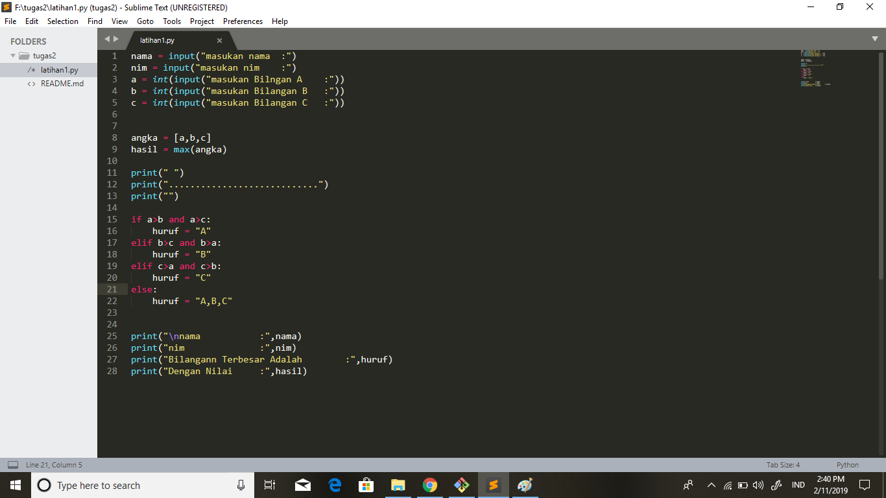
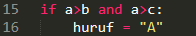
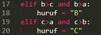
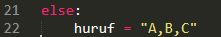
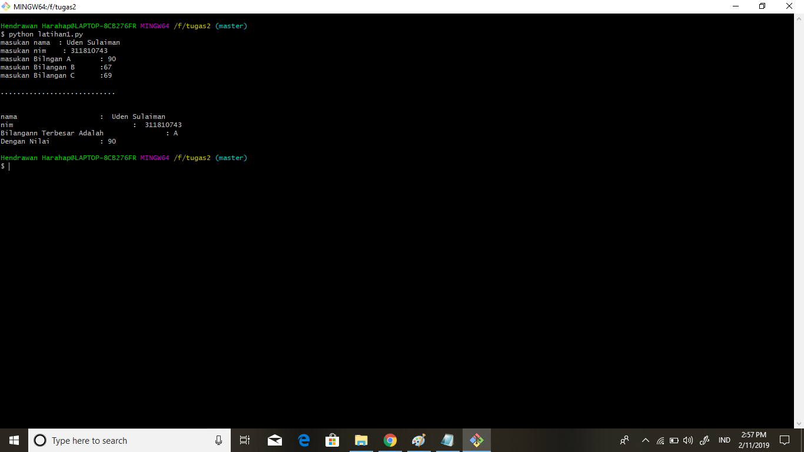

CARA MENGGUNAKAN IF DAN  ELSE DI PYTHON

- Ada tiga macam kondisional di python.yang dapat anda gunakan untuk membangun alur logika untuk programm anda.python memilikistatement if,if.else,dan Ada tiga macam kondisional di Python, yang dapat Anda gunakan untuk membangun alur logika untuk program Anda. Python memiliki statement if, if..else, dan if..elif..else.
Berikut ini adalah contoh penggunaan if di Python:

- Untuk memeriksa kondisi yang tidak memenuhi kondisi utama. Maka else digunakan untk menangani semua kondisi selain kondisi yang telah dituliskan.
Berikut adalah contoh penggunaan else di dalam kondisional Python:

- Bila kondisi yang akan didefinisikan cukup banyak, Anda dapat menambah kondisi lain dengan menggunakan elif di bawah statement if dan sebelum statement else:

- Hasil outputnya

